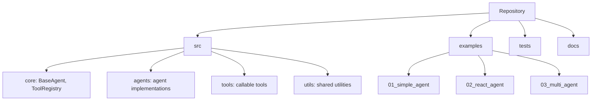
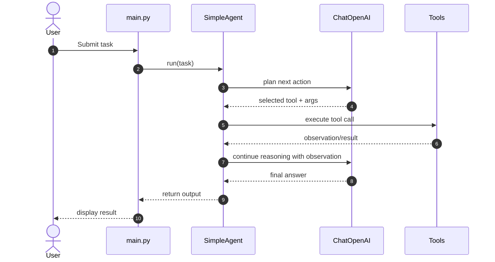
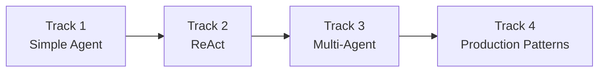

# Langchain Agentic AI

[](https://www.python.org/)
[](LICENSE)
[](https://python.langchain.com/)

## Description

Langchain Agentic AI is a project module focused on implementing and hardening agentic workflows with LangChain.
The repository is organized as staged implementation tracks, where each track adds capability while preserving code quality, testability, and clear interfaces.

## Scope

- Build reusable agent foundations (`BaseAgent`, `ToolRegistry`)
- Implement progressively more capable agent patterns
- Provide runnable examples for each track
- Maintain tests and documentation as part of delivery

## Current Status

- Track 1 implemented: smart task execution agent with practical planning tools
- Core abstractions in place under `src/core`
- Unit tests available for foundational components
- Tracks 2 and 3 scaffolded for ReAct and multi-agent expansion

## Architecture



```text
src/
	core/      base abstractions and tool management
	agents/    agent implementations
	tools/     callable tool definitions
	utils/     shared utility code

examples/
	01_simple_agent/
	02_react_agent/
	03_multi_agent/

tests/
docs/
```

## Execution Workflow

1. User task is submitted to an agent entry point.
2. Agent selects a tool/action through the LLM policy.
3. Tool executes and returns observation data.
4. Agent iterates until completion or iteration limit.
5. Final response and execution trace are returned.



## Setup

### Prerequisites

- Python 3.10+
- pip
- LLM provider API key (`OPENAI_API_KEY` or `ANTHROPIC_API_KEY`)

### Installation

```bash
git clone https://github.com/FLotfiGit/Langchain-Agentic-AI.git
cd Langchain-Agentic-AI
python -m venv venv
source venv/bin/activate  # Windows: venv\Scripts\activate
pip install -r requirements.txt
cp .env.example .env
```

Update `.env` with credentials before running examples.

## Run

```bash
cd examples/01_simple_agent
python main.py
```

## Test

```bash
pytest tests/ -v
pytest tests/ --cov=src
```

## Roadmap

- Track 1: Smart task execution (prioritize, schedule, risk review, next actions)
- Track 2: ReAct-style structured reasoning loop
- Track 3: Multi-agent coordination and delegation
- Track 4: Production concerns (memory, observability, planning)



## Documentation

- [docs/GETTING_STARTED.md](docs/GETTING_STARTED.md)
- [docs/ARCHITECTURE.md](docs/ARCHITECTURE.md)
- [CONTRIBUTING.md](CONTRIBUTING.md)

## Maintainer

Fatemeh Lotfi

Applied AI Scientist, PhD

## License

MIT License. See [LICENSE](LICENSE).
